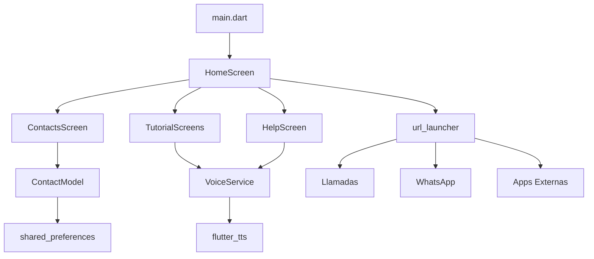

# 📱 Conecta con Amor

<div align="center">


**Una aplicación Flutter diseñada especialmente para adultos mayores**
*Interfaz simple, botones grandes y guía por voz en español*
</div>

---
## 🚀 Instalación y Ejecución

### 📋 Prerrequisitos

| Herramienta | Versión Mínima | Recomendada |
|-------------|----------------|-------------|
| Flutter SDK | 3.35.1 | Última estable |
| Dart | 3.5.1 | Incluido con Flutter |
| Android Studio | 2023.1 | Última versión |
| VS Code | 1.80+ | Con extensión Flutter |

### 🛠️ Configuración del Entorno

1. **Instalar Flutter**
   ```bash
   # Verificar instalación
   flutter doctor

   # Debe mostrar ✓ en Android toolchain y VS Code/Android Studio
   ```

2. **Clonar el repositorio**
   ```bash
   git clone https://github.com/hans-07/conecta-con-amor.git
   cd conecta_con_amor
   ```

3. **Instalar dependencias**
   ```bash
   flutter pub get
   ```

4. **Verificar dispositivos**
   ```bash
   flutter devices
   ```

### 🏃‍♂️ Ejecutar la Aplicación

#### Modo Desarrollo
```bash
# Android
flutter run -d android

# iOS (solo en macOS)
flutter run -d ios

# Escritorio (Linux/Windows/macOS)
flutter run -d linux
flutter run -d windows
flutter run -d macos
```

#### Compilar para Producción
```bash
# APK para Android
flutter build apk --release

# App Bundle (recomendado para Play Store)
flutter build appbundle --release

# iOS (solo en macOS)
flutter build ios --release
```

### 📦 Archivos Generados
- **APK**: `build/app/outputs/flutter-apk/app-release.apk`
- **App Bundle**: `build/app/outputs/bundle/release/app-release.aab`

## 🏗️ Estructura del Proyecto

```
conecta_con_amor/
├── 📁 lib/
│   ├── 🚀 main.dart                      # Punto de entrada de la aplicación
│   ├── 📱 screens/                       # Pantallas de la aplicación
│   │   ├── home_screen.dart              # 🏠 Pantalla principal con launcher
│   │   ├── contacts_screen.dart          # 👥 Gestión de contactos favoritos
│   │   ├── help_screen.dart              # ❓ Centro de ayuda y soporte
│   │   ├── whatsapp_tutorial_screen.dart # 💬 Tutorial interactivo de WhatsApp
│   │   └── call_tutorial_screen.dart     # 📞 Tutorial interactivo de llamadas
│   ├── 🔧 services/                      # Servicios de la aplicación
│   │   ├── voice_service.dart            # 🗣️ Texto a voz (TTS) en español
│   │   └── emergency_service.dart        # 🚨 Gestión de emergencias y SMS
│   ├── 🧩 widgets/                       # Widgets reutilizables
│   │   └── big_button.dart               # 🔘 Botón grande personalizado
│   └── 📊 models/                        # Modelos de datos
│       └── contact_model.dart            # 👤 Modelo de contacto con JSON
├── 📁 android/                           # Configuración específica de Android
├── 📁 ios/                               # Configuración específica de iOS
├── 📁 assets/                            # Recursos estáticos
│   └── images/                           # Imágenes y iconos
├── 📄 pubspec.yaml                       # Dependencias y configuración
└── 📖 README.md                          # Este archivo
```
---

## 🔧 Dependencias y Tecnologías

### 📦 **Dependencias Principales**

| Paquete | Versión | Propósito | Documentación |
|---------|---------|-----------|---------------|
| `url_launcher` | ^6.2.4 | Llamadas, SMS, WhatsApp, Apps externas | [📖 Docs](https://pub.dev/packages/url_launcher) |
| `flutter_tts` | ^4.0.2 | Texto a voz en español (TTS) | [📖 Docs](https://pub.dev/packages/flutter_tts) |
| `image_picker` | ^1.0.7 | Acceso a galería de fotos | [📖 Docs](https://pub.dev/packages/image_picker) |
| `vibration` | ^1.8.4 | Feedback háptico y vibración | [📖 Docs](https://pub.dev/packages/vibration) |
| `shared_preferences` | ^2.2.2 | Almacenamiento local persistente | [📖 Docs](https://pub.dev/packages/shared_preferences) |
| `overlay_support` | ^2.1.0 | Superposiciones para tutoriales | [📖 Docs](https://pub.dev/packages/overlay_support) |

### 🛠️ **Dependencias de Desarrollo**

| Paquete | Versión | Propósito |
|---------|---------|-----------|
| `flutter_test` | SDK | Testing framework |
| `flutter_lints` | ^3.0.0 | Análisis de código |

### 🏗️ **Arquitectura Técnica**


---

### 🔍 **Análisis de Código**
```bash
# Ejecutar análisis estático
flutter analyze

# Ejecutar todas las pruebas
flutter test

# Generar reporte de cobertura
flutter test --coverage
```
---

#### Estilo de Código
- Seguir las [convenciones de Dart](https://dart.dev/guides/language/effective-dart)
- Usar `flutter format` antes de cada commit
- Mantener cobertura de pruebas > 80%
