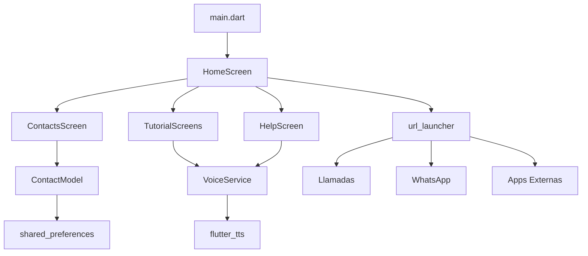

# 📱 Conecta con Amor

<div align="center">


**Una aplicación Flutter diseñada especialmente para adultos mayores**
*Interfaz simple, botones grandes y guía por voz en español*

[📱 Descargar APK](#-instalación-y-ejecución) • [📖 Documentación](#-funcionalidades-principales) • [🤝 Contribuir](#-contribuir)

</div>

---

## ✨ Características Principales

### 🎯 **Diseño Inclusivo**
- **Interfaz ultra-simple**: Botones grandes (120x120px) y fáciles de tocar
- **Tipografía accesible**: Texto de 18-32px para mejor legibilidad
- **Colores contrastantes**: Diseño optimizado para problemas de visión
- **Espaciado generoso**: Elementos bien separados para evitar toques accidentales

### 🗣️ **Accesibilidad Completa**
- **Guía por voz**: Instrucciones claras en español con TTS
- **TalkBack compatible**: Etiquetas Semantics en todos los elementos
- **Anuncios contextuales**: Feedback de voz para cada acción
- **Botón de ayuda**: Repetir instrucciones en cualquier momento

### 📞 **Comunicación Simplificada**
- **Llamadas fáciles**: Acceso directo al marcador telefónico
- **WhatsApp integrado**: Envío de mensajes paso a paso
- **Contactos favoritos**: Lista personalizable con opciones de eliminar
- **Tutoriales interactivos**: Guías completas para llamadas y WhatsApp

### 📱 **Más Aplicaciones**
- **Launcher integrado**: Acceso a 9 aplicaciones populares
- **Lanzamiento inteligente**: Sistema robusto con múltiples fallbacks
- **Apps incluidas**: Cámara, Música, Mapas, Gmail, Chrome, YouTube, Facebook, Play Store, Configuración

### 🚨 **Seguridad y Emergencias**
- **Función de emergencia**: Envío rápido de SMS de ayuda
- **Contactos de emergencia**: Configuración fácil de números importantes
- **Sin permisos complejos**: Privacidad y seguridad garantizadas

## 🚀 Instalación y Ejecución

### 📋 Prerrequisitos

| Herramienta | Versión Mínima | Recomendada |
|-------------|----------------|-------------|
| Flutter SDK | 3.35.1 | Última estable |
| Dart | 3.5.1 | Incluido con Flutter |
| Android Studio | 2023.1 | Última versión |
| VS Code | 1.80+ | Con extensión Flutter |

### 🛠️ Configuración del Entorno

1. **Instalar Flutter**
   ```bash
   # Verificar instalación
   flutter doctor

   # Debe mostrar ✓ en Android toolchain y VS Code/Android Studio
   ```

2. **Clonar el repositorio**
   ```bash
   git clone https://github.com/hans-07/conecta-con-amor.git
   cd conecta_con_amor
   ```

3. **Instalar dependencias**
   ```bash
   flutter pub get
   ```

4. **Verificar dispositivos**
   ```bash
   flutter devices
   ```

### 🏃‍♂️ Ejecutar la Aplicación

#### Modo Desarrollo
```bash
# Android
flutter run -d android

# iOS (solo en macOS)
flutter run -d ios

# Escritorio (Linux/Windows/macOS)
flutter run -d linux
flutter run -d windows
flutter run -d macos
```

#### Compilar para Producción
```bash
# APK para Android
flutter build apk --release

# App Bundle (recomendado para Play Store)
flutter build appbundle --release

# iOS (solo en macOS)
flutter build ios --release
```

### 📦 Archivos Generados
- **APK**: `build/app/outputs/flutter-apk/app-release.apk`
- **App Bundle**: `build/app/outputs/bundle/release/app-release.aab`

## 🏗️ Estructura del Proyecto

```
conecta_con_amor/
├── 📁 lib/
│   ├── 🚀 main.dart                      # Punto de entrada de la aplicación
│   ├── 📱 screens/                       # Pantallas de la aplicación
│   │   ├── home_screen.dart              # 🏠 Pantalla principal con launcher
│   │   ├── contacts_screen.dart          # 👥 Gestión de contactos favoritos
│   │   ├── help_screen.dart              # ❓ Centro de ayuda y soporte
│   │   ├── whatsapp_tutorial_screen.dart # 💬 Tutorial interactivo de WhatsApp
│   │   └── call_tutorial_screen.dart     # 📞 Tutorial interactivo de llamadas
│   ├── 🔧 services/                      # Servicios de la aplicación
│   │   ├── voice_service.dart            # 🗣️ Texto a voz (TTS) en español
│   │   └── emergency_service.dart        # 🚨 Gestión de emergencias y SMS
│   ├── 🧩 widgets/                       # Widgets reutilizables
│   │   └── big_button.dart               # 🔘 Botón grande personalizado
│   └── 📊 models/                        # Modelos de datos
│       └── contact_model.dart            # 👤 Modelo de contacto con JSON
├── 📁 android/                           # Configuración específica de Android
├── 📁 ios/                               # Configuración específica de iOS
├── 📁 assets/                            # Recursos estáticos
│   └── images/                           # Imágenes y iconos
├── 📄 pubspec.yaml                       # Dependencias y configuración
└── 📖 README.md                          # Este archivo
```

### 📋 Descripción de Componentes

| Componente | Descripción | Funcionalidades |
|------------|-------------|-----------------|
| **HomeScreen** | Pantalla principal | Launcher con 5 botones principales + Más Apps |
| **ContactsScreen** | Gestión de contactos | Agregar, eliminar, llamar, WhatsApp |
| **TutorialScreens** | Tutoriales interactivos | Guías paso a paso con voz y accesibilidad |
| **VoiceService** | Servicio de voz | TTS en español, anuncios contextuales |
| **EmergencyService** | Servicio de emergencias | SMS automáticos, contactos de emergencia |

## 🎨 Principios de Diseño

### 🎯 **Accesibilidad Universal**
- **Contraste alto**: Cumple con WCAG 2.1 AA
- **Tipografía escalable**: 18-32px con soporte para zoom del sistema
- **Espaciado táctil**: Mínimo 44x44px para elementos interactivos
- **Iconos universales**: Símbolos reconocibles internacionalmente

### 🌈 **Paleta de Colores**
```css
/* Colores principales */
--primary-green: #4CAF50    /* Llamadas */
--whatsapp-green: #25D366   /* WhatsApp */
--emergency-red: #F44336    /* Emergencias */
--orange-apps: #FF9800      /* Más Apps */
--purple-photos: #9C27B0    /* Fotos */
--blue-help: #2196F3        /* Ayuda */
```

### 📐 **Sistema de Grid**
- **Grid 2x2**: Pantalla principal (5 botones + Más Apps)
- **Grid 3x3**: Modal de aplicaciones
- **Lista vertical**: Contactos y tutoriales

---

## 📋 Funcionalidades Detalladas

### 🏠 **Pantalla Principal**
<details>
<summary>Ver características completas</summary>

- **5 botones principales** organizados en grid 2x2 + 1
- **Saludo personalizado** con hora del día
- **Footer motivacional** con mensajes rotativos
- **Accesibilidad completa** con anuncios de voz
- **Animaciones suaves** para feedback visual

**Botones incluidos:**
- 📞 **Llamadas** → Tutorial + Marcador nativo
- 💬 **WhatsApp** → Tutorial + Integración directa
- 👥 **Contactos** → Gestión completa de favoritos
- 📸 **Fotos** → Acceso a galería del sistema
- 📱 **Más Apps** → Launcher con 9 aplicaciones populares

</details>

### 📞 **Sistema de Llamadas**
<details>
<summary>Ver características completas</summary>

**Tutorial Interactivo:**
- ✅ Guía paso a paso con voz
- ✅ Simulación de marcado
- ✅ Teclado nativo del dispositivo
- ✅ Feedback visual y auditivo
- ✅ Botón de ayuda contextual

**Funcionalidades:**
- Abre el marcador telefónico nativo
- Sin permisos especiales requeridos
- Compatible con todos los dispositivos
- Integración con contactos favoritos

</details>

### 💬 **WhatsApp Integrado**
<details>
<summary>Ver características completas</summary>

**Tutorial Completo:**
- ✅ 6 pasos interactivos
- ✅ Simulación de selección de contacto
- ✅ Campo de texto con teclado nativo
- ✅ Botón de envío animado
- ✅ Anuncios de voz contextuales

**Características:**
- Detección automática de instalación
- Integración directa con la app
- Selección de contactos simplificada
- Mensajes predefinidos opcionales

</details>

### 👥 **Gestión de Contactos**
<details>
<summary>Ver características completas</summary>

**Funcionalidades Avanzadas:**
- ✅ **Agregar contactos** con formulario simple
- ✅ **Eliminar contactos** con confirmación segura
- ✅ **Función "Deshacer"** por 3 segundos
- ✅ **Menú contextual** (Llamar, WhatsApp, Eliminar)
- ✅ **Contactos de emergencia** marcados especialmente
- ✅ **Persistencia local** con SharedPreferences

**Interfaz:**
- Lista vertical con avatares coloridos
- Botones de acción en menú desplegable
- Diálogos de confirmación claros
- Feedback visual y auditivo completo

</details>

### 📱 **Más Aplicaciones**
<details>
<summary>Ver características completas</summary>

**Launcher Integrado:**
- ✅ **9 aplicaciones populares** preconfiguradas
- ✅ **Modal bottom sheet** responsivo
- ✅ **Sistema de lanzamiento robusto** con 3 fallbacks
- ✅ **Manejo de errores** elegante
- ✅ **Accesibilidad completa** con TalkBack

**Apps Incluidas:**
- 📷 **Cámara** → com.android.camera2
- 🎵 **Música** → com.google.android.music
- 🗺️ **Mapas** → com.google.android.apps.maps
- 📧 **Gmail** → com.google.android.gm
- 🌐 **Chrome** → com.android.chrome
- 📺 **YouTube** → com.google.android.youtube
- 👥 **Facebook** → com.facebook.katana
- 🛒 **Play Store** → com.android.vending
- ⚙️ **Configuración** → com.android.settings

</details>

### 🚨 **Sistema de Emergencias**
<details>
<summary>Ver características completas</summary>

- **SMS automáticos** a contactos predefinidos
- **Mensajes personalizables** según la situación
- **Sin permisos de ubicación** (privacidad garantizada)
- **Activación rápida** con confirmación
- **Lista de contactos de emergencia** configurable

</details>

### ❓ **Centro de Ayuda**
<details>
<summary>Ver características completas</summary>

**Tutoriales Interactivos:**
- ✅ **Tutorial de WhatsApp** (6 pasos)
- ✅ **Tutorial de Llamadas** (5 pasos)
- ✅ **Guías paso a paso** con voz
- ✅ **Botón de repetir** instrucciones
- ✅ **Navegación intuitiva** entre pasos

**Características de Accesibilidad:**
- Anuncios de voz automáticos
- Etiquetas Semantics completas
- Compatible con TalkBack/VoiceOver
- Feedback multimodal (voz + vibración + visual)

</details>

## 🔧 Dependencias y Tecnologías

### 📦 **Dependencias Principales**

| Paquete | Versión | Propósito | Documentación |
|---------|---------|-----------|---------------|
| `url_launcher` | ^6.2.4 | Llamadas, SMS, WhatsApp, Apps externas | [📖 Docs](https://pub.dev/packages/url_launcher) |
| `flutter_tts` | ^4.0.2 | Texto a voz en español (TTS) | [📖 Docs](https://pub.dev/packages/flutter_tts) |
| `image_picker` | ^1.0.7 | Acceso a galería de fotos | [📖 Docs](https://pub.dev/packages/image_picker) |
| `vibration` | ^1.8.4 | Feedback háptico y vibración | [📖 Docs](https://pub.dev/packages/vibration) |
| `shared_preferences` | ^2.2.2 | Almacenamiento local persistente | [📖 Docs](https://pub.dev/packages/shared_preferences) |
| `overlay_support` | ^2.1.0 | Superposiciones para tutoriales | [📖 Docs](https://pub.dev/packages/overlay_support) |

### 🛠️ **Dependencias de Desarrollo**

| Paquete | Versión | Propósito |
|---------|---------|-----------|
| `flutter_test` | SDK | Testing framework |
| `flutter_lints` | ^3.0.0 | Análisis de código |

### 🏗️ **Arquitectura Técnica**



### 🔒 **Permisos Requeridos**

#### Android (`android/app/src/main/AndroidManifest.xml`)
```xml
<!-- Permisos básicos -->
<uses-permission android:name="android.permission.INTERNET" />
<uses-permission android:name="android.permission.VIBRATE" />

<!-- Permisos opcionales (solo si se usan) -->
<uses-permission android:name="android.permission.CALL_PHONE" />
<uses-permission android:name="android.permission.SEND_SMS" />
<uses-permission android:name="android.permission.READ_EXTERNAL_STORAGE" />
```

#### iOS (`ios/Runner/Info.plist`)
```xml
<!-- Descripción de uso de micrófono (para TTS) -->
<key>NSMicrophoneUsageDescription</key>
<string>Esta app usa el micrófono para funciones de accesibilidad</string>

<!-- Descripción de acceso a fotos -->
<key>NSPhotoLibraryUsageDescription</key>
<string>Esta app accede a fotos para mostrar la galería</string>
```

## 🎯 Público Objetivo

### 👥 **Usuarios Principales**
- **Adultos mayores (65+ años)** con poca experiencia tecnológica
- **Personas con discapacidades visuales** que necesitan accesibilidad
- **Usuarios con problemas motores** que requieren botones grandes
- **Familias** que buscan facilitar la comunicación con adultos mayores

### 📊 **Casos de Uso**
- **Comunicación familiar**: Llamadas y WhatsApp simplificados
- **Emergencias**: Contacto rápido con familiares y servicios
- **Entretenimiento**: Acceso fácil a fotos y aplicaciones
- **Aprendizaje**: Tutoriales paso a paso para nuevas tecnologías

---

## 🧪 Testing y Calidad

### ✅ **Pruebas Implementadas**
- **Pruebas unitarias** para servicios críticos
- **Pruebas de widgets** para componentes principales
- **Pruebas de integración** para flujos completos
- **Pruebas de accesibilidad** con TalkBack/VoiceOver

### 🔍 **Análisis de Código**
```bash
# Ejecutar análisis estático
flutter analyze

# Ejecutar todas las pruebas
flutter test

# Generar reporte de cobertura
flutter test --coverage
```

### 📱 **Dispositivos Probados**
- **Android**: 8.0+ (API 26+)
- **iOS**: 12.0+
- **Pantallas**: 4.7" a 6.7"
- **Resoluciones**: 720p a 1440p

---

## 🚀 Roadmap y Futuras Mejoras

### 🔄 **Versión Actual (v1.0)**
- ✅ Funcionalidades básicas implementadas
- ✅ Tutoriales interactivos completos
- ✅ Accesibilidad total con TalkBack
- ✅ Gestión de contactos avanzada
- ✅ Launcher de aplicaciones integrado

### 📋 **Próximas Versiones**

#### v1.1 - Mejoras de UX
- [ ] **Temas personalizables** (claro/oscuro)
- [ ] **Tamaño de fuente ajustable**
- [ ] **Más idiomas** (inglés, portugués)
- [ ] **Backup en la nube** de contactos

#### v1.2 - Funcionalidades Avanzadas
- [ ] **Videollamadas** simplificadas
- [ ] **Recordatorios de medicamentos**
- [ ] **Integración con calendarios**
- [ ] **Modo familia** para configuración remota

#### v2.0 - Inteligencia Artificial
- [ ] **Asistente de voz** personalizado
- [ ] **Reconocimiento de comandos**
- [ ] **Sugerencias inteligentes**
- [ ] **Detección de emergencias automática**

---

## 🤝 Contribuir al Proyecto

### 🛠️ **Cómo Contribuir**

1. **Fork** el repositorio
2. **Clona** tu fork localmente
   ```bash
   git clone https://github.com/tu-usuario/conecta-con-amor.git
   ```
3. **Crea** una rama para tu feature
   ```bash
   git checkout -b feature/nueva-funcionalidad
   ```
4. **Desarrolla** y **prueba** tus cambios
5. **Commit** con mensajes descriptivos
   ```bash
   git commit -m "feat: agregar nueva funcionalidad X"
   ```
6. **Push** a tu fork
   ```bash
   git push origin feature/nueva-funcionalidad
   ```
7. **Crea** un Pull Request detallado

### 📝 **Guías de Contribución**

#### Estilo de Código
- Seguir las [convenciones de Dart](https://dart.dev/guides/language/effective-dart)
- Usar `flutter format` antes de cada commit
- Mantener cobertura de pruebas > 80%

#### Commits Semánticos
```
feat: nueva funcionalidad
fix: corrección de bug
docs: actualización de documentación
style: cambios de formato
refactor: refactorización de código
test: agregar o modificar pruebas
```

#### Issues y Bugs
- Usar las plantillas proporcionadas
- Incluir pasos para reproducir
- Especificar dispositivo y versión de Android/iOS
- Adjuntar capturas de pantalla si es relevante

### 🏆 **Reconocimientos**

Agradecemos a todos los contribuidores que han hecho posible este proyecto:

<!-- Aquí se pueden agregar contribuidores cuando los haya -->

---

## 📄 Licencia

```
MIT License

Copyright (c) 2024 Conecta con Amor

Permission is hereby granted, free of charge, to any person obtaining a copy
of this software and associated documentation files (the "Software"), to deal
in the Software without restriction, including without limitation the rights
to use, copy, modify, merge, publish, distribute, sublicense, and/or sell
copies of the Software, and to permit persons to whom the Software is
furnished to do so, subject to the following conditions:

The above copyright notice and this permission notice shall be included in all
copies or substantial portions of the Software.

THE SOFTWARE IS PROVIDED "AS IS", WITHOUT WARRANTY OF ANY KIND, EXPRESS OR
IMPLIED, INCLUDING BUT NOT LIMITED TO THE WARRANTIES OF MERCHANTABILITY,
FITNESS FOR A PARTICULAR PURPOSE AND NONINFRINGEMENT. IN NO EVENT SHALL THE
AUTHORS OR COPYRIGHT HOLDERS BE LIABLE FOR ANY CLAIM, DAMAGES OR OTHER
LIABILITY, WHETHER IN AN ACTION OF CONTRACT, TORT OR OTHERWISE, ARISING FROM,
OUT OF OR IN CONNECTION WITH THE SOFTWARE OR THE USE OR OTHER DEALINGS IN THE
SOFTWARE.
```

---

## 💝 Hecho con Amor

<div align="center">

**Desarrollado pensando en nuestros adultos mayores**
*Para que puedan mantenerse conectados con sus seres queridos de manera fácil y segura*

### 🌟 **Misión**
Democratizar el acceso a la tecnología para adultos mayores, eliminando barreras y creando puentes digitales entre generaciones.

### 💡 **Visión**
Un mundo donde la edad no sea un obstáculo para disfrutar de los beneficios de la tecnología moderna.

---

**¿Te gusta el proyecto? ¡Dale una ⭐ en GitHub!**

[🐛 Reportar Bug](https://github.com/hans-07/conecta-con-amor/issues) •
[💡 Sugerir Feature](https://github.com/hans-07/conecta-con-amor/issues) •
[📧 Contacto](parrahans70@gmail.com)

</div>
